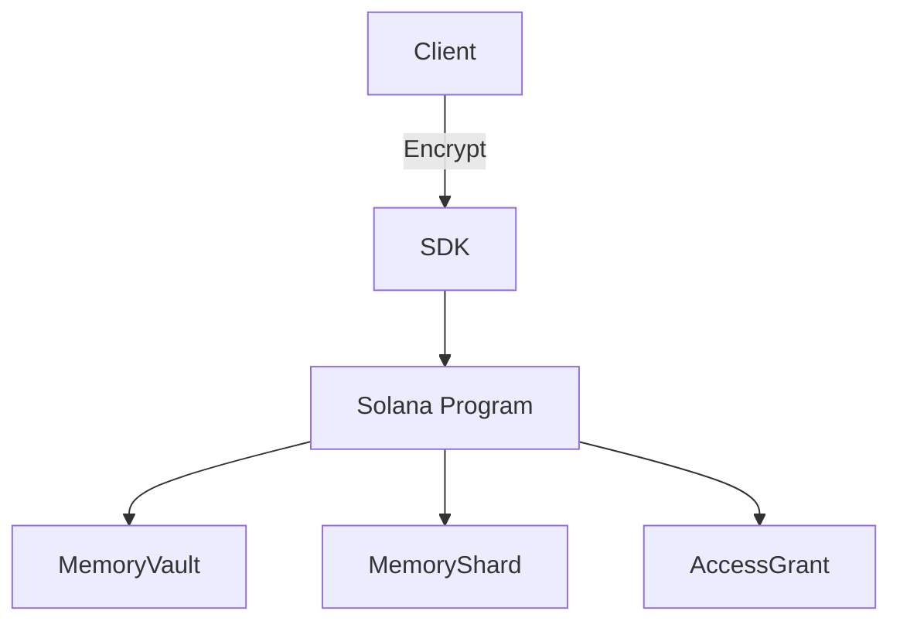

# 視覺素材需求清單

## 1. Hero Banner (主視覺橫幅)

### 規格
- **尺寸**: 1200 x 400 px (或 2400 x 800 px for retina)
- **格式**: PNG / SVG / GIF (動態)
- **風格**: Cyberpunk + AI + Solana 藍紫色系

### 設計元素建議
```
┌─────────────────────────────────────────────────────────────┐
│  [深色太空/數碼背景]                                         │
│                                                             │
│     🧠  [大腦/記憶晶片圖示]  ←→  ⛓️  [Solana Logo]        │
│                                                             │
│         "AgentMemory Protocol"                              │
│         On-Chain Persistent Memory for AI Agents            │
│                                                             │
└─────────────────────────────────────────────────────────────┘
```

### 配色建議
- 主色: `#00D4FF` (Solana Cyan)
- 輔色: `#9945FF` (Solana Purple)
- 背景: `#0A0A1A` (深空藍黑)
- 強調: `#FFD700` (金色 highlight)

### 製作工具
- Figma (推薦)
- Canva
- Adobe Illustrator
- Midjourney / DALL-E (AI 生成基礎圖)

---

## 2. Demo GIF (功能展示動畫)

### 規格
- **時長**: 15 秒
- **解析度**: 800 x 600 px
- **格式**: GIF / MP4 (GitHub 支援)
- **幀率**: 30fps

### 內容腳本

```
第 1-3 秒:   標題卡 - "Without AgentMemory"
第 4-7 秒:   展示對話 1 - Agent 忘記用戶名字
第 8 秒:     轉場動畫
第 9-11 秒:  標題卡 - "With AgentMemory"
第 12-15 秒: 展示對話 2 - Agent 記得用戶名字
```

### 製作工具
- Loom (螢幕錄製)
- Screen Studio (Mac)
- OBS Studio
- After Effects / Premiere
- Kap (GIF 製作)

---

## 3. Architecture Diagram (架構圖)

### 選項 A: ASCII Art (已內建於 README)
- ✅ 零維護成本
- ✅ GitHub 原生支援
- ⚠️ 視覺效果較弱

### 選項 B: SVG 向量圖
- **尺寸**: 1000 x 600 px
- **格式**: SVG
- **優點**: 可縮放、可編輯、檔案小

### 選項 C: Mermaid Diagram
```markdown

```

### 製作工具
- Excalidraw (手繪風)
- Figma
- draw.io / diagrams.net
- Mermaid Live Editor

---

## 4. Feature Icons (功能圖示)

### 建議清單
| 功能 | 圖示建議 | Unicode |
|------|----------|---------|
| 加密 | 🔐 | `U+1F510` |
| 記憶 | 🧠 | `U+1F9E0` |
| 分享 | 🤝 | `U+1F91D` |
| 批量 | 📦 | `U+1F4E6` |
| 經濟 | 💰 | `U+1F4B0` |
| 日誌 | 📊 | `U+1F4CA` |
| 版本 | 🔄 | `U+1F504` |
| 身份 | 👤 | `U+1F464` |

### 替代方案
- [Fluent Emoji](https://github.com/microsoft/fluentui-emoji) (Microsoft)
- [Noto Emoji](https://fonts.google.com/noto/specimen/Noto+Emoji) (Google)
- [OpenMoji](https://openmoji.org/) (開源)
- [Heroicons](https://heroicons.com/) (SVG)

---

## 5. Badge Assets (徽章)

### 靜態 Badges
已使用 shields.io 動態生成，無需額外素材

### 自訂 Badge (可選)
如需品牌一致性，可設計：
- Build Status: 綠色/紅色/黃色
- Version: 藍色
- License: 黃色

---

## 6. Social Preview (GitHub 社交預覽)

### 規格
- **尺寸**: 1280 x 640 px
- **用途**: GitHub 分享連結時顯示
- **位置**: Settings → Social preview

### 設計要點
- 左側放 Logo/標題
- 右側放簡短描述
- 中央留空給 GitHub 疊加資訊

---

## 7. 優先級建議

| 優先級 | 項目 | 原因 |
|--------|------|------|
| 🔴 P0 | Hero Banner | 第一印象決定 hackathon 評分 |
| 🔴 P0 | Demo GIF | 快速展示核心價值 |
| 🟡 P1 | Architecture SVG | 技術深度展示 |
| 🟡 P1 | Social Preview | GitHub 專業度 |
| 🟢 P2 | Custom Icons | 加分項 |

---

## 8. 檔案命名規範

```
assets/
├── banner-1200x400.png       # Hero banner
├── banner-2400x800.png       # Retina banner
├── demo-15s.gif              # Demo animation
├── demo-15s.mp4              # Demo video (backup)
├── architecture.svg          # Architecture diagram
├── architecture-dark.svg     # Dark mode version
├── social-preview-1280x640.png
└── icons/
    ├── icon-encryption.svg
    ├── icon-memory.svg
    └── ...
```

---

## 9. 設計資源參考

### Solana 品牌資源
- [Solana Brand Kit](https://solana.com/branding)
- Solana 標準色: `#00D4FF`, `#9945FF`

### Hackathon 成功案例
- [LangChain README](https://github.com/langchain-ai/langchain)
- [Eliza README](https://github.com/elizaOS/eliza)
- [AutoGPT README](https://github.com/Significant-Gravitas/AutoGPT)

---

## 10. 快速製作 Checklist

- [ ] Hero Banner (1200x400) - Figma/Canva
- [ ] Demo GIF (15s) - Loom + Kap
- [ ] Architecture SVG - Excalidraw
- [ ] Social Preview (1280x640) - Figma
- [ ] 上傳至 `assets/` 資料夾
- [ ] 更新 README 圖片連結
